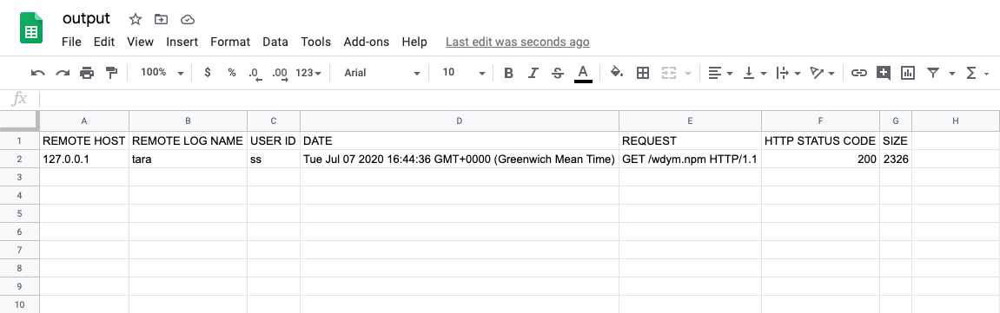

[](https://badge.fury.io/js/wdym)

[](https://travis-ci.com/abircb/wdym)

# wdym

**See also**: [Node.js API Documentation](https://github.com/abircb/wdym/wiki/API-Documentation)

Convert [Common Log Format](https://httpd.apache.org/docs/1.3/logs.html#common) into more useful (and human-readable) JSON and/or CSV. Especially handy when analysing server log files for activity and performance.

Can be used both as a [Node.js library](https://github.com/abircb/wdym/wiki/API-Documentation) and as a [command line executable](#command-line-executable).

For example, standard log input such as

```txt
127.0.0.1 tara ss [07/Jul/2020:16:44:36 +0000] "GET /wdym.npm HTTP/1.1" 200 2326
```

would be converted to

```json
{
  "log": [
    {
      "remoteHost": "127.0.0.1",
      "remoteLogName": "tara",
      "authUser": "ss",
      "date": "2020-07-07T16:44:36.000Z",
      "request": "GET /wdym.npm HTTP/1.1",
      "status": 200,
      "size": 2326
    }
  ]
}
```

or



## Usage

### Node.js Library

#### Installation:

```cli
$ npm install --save-dev wdym
```

#### Getting started:

Here is a simple example to convert an incoming `stream` of CLF logs to CSV using `wdym` and the Node.js Streams API.

```js
const wdymCSV = require('wdym').csv
const { pipeline } = require('stream') // API: https://nodejs.org/api/stream.html#stream_stream_pipeline_source_transforms_destination_callback

pipeline(source, wdymCSV, destination, (err) => {
  if (err) {
    console.error('Pipeline failed.', err)
  } else {
    console.log('Pipeline succeeded.')
  }
}
//  127.0.0.1 - g [27/Apr/2012:09:57:36 +0000] "GET /ss.html HTTP/1.1"  200 2326
// =>
//  REMOTE HOST,REMOTE LOG NAME,USER ID,DATE,REQUEST,HTTP STATUS CODE,SIZE
//  127.0.0.1,-,g,Fri Apr 27 2012 09:57:36 GMT+0000 (Greenwich Mean Time),GET /ss.html HTTP/1.1,200,2326
//  Pipeline succeeded.
```

**See more**: [API Documentation](https://github.com/abircb/wdym/wiki/API-Documentation)

### Command Line Executable

#### Installation:

```cli
$ npm install -g wdym
```

#### Getting started:

```cli
$ wdym --help

  Usage
    $ wdym <file> <options>

  Default behaviour (no options): simply converts log file contents into JSON and writes to the shell (via stdout)

  Options
       --csv               convert log file into CSV
       --write             write to file (./output.csv or ./output.json)
   -v, --version           output the version number
   -h, --help              usage information


  Examples
    $ wdym log.txt --write         converts log file into JSON and writes to output.json
    $ wdym log.txt --csv           converts log file contents into CSV and writes to shell
    $ wdym log.txt --csv --write   converts log file contents into CSV and writes to output.csv
```

### Piped Input

**Example**:

```cli
$ cat log.txt | wdym --write
```

converts log file into JSON and writes to `output.json`
